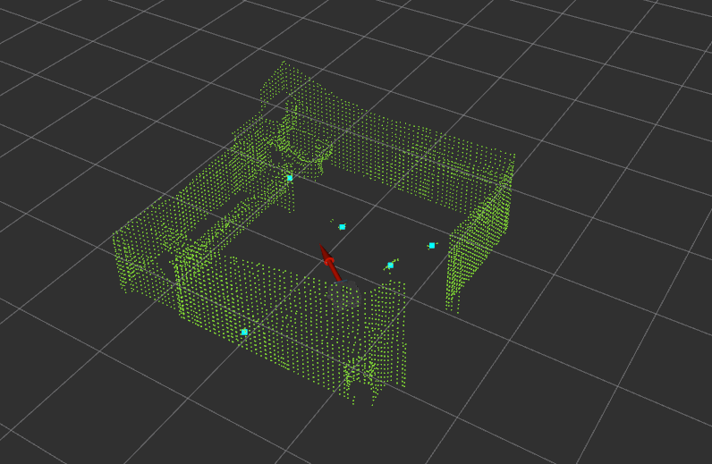

# team cerberus
### Docker image

Assumes `docker` and `nvidia-docker2` are installed.

```bash

# build image once
sudo docker build -t cerberus .

# run container and launch file
sudo chmod a+x run_cerberus.sh
sudo ./run_cerberus.sh

# for bash access in a separate terminal
sudo docker exec -it cerberus bash
```

Please note the simulation is paused initially


### Launching the simulation 
```bash
source ~/catkin_ws/devel/setup.bash
roslaunch cerberus_gazebo combined_launch.launch # launch gazebo with gripper
```
(Running docker will run automatically launch the above one)

On another terminal, run the docker and in the bash, run the following. This will explore to map restroom environment
```bash
source ~/catkin_ws/devel/setup.bash
roslaunch cerberus_navigation explore.launch
```


For bot to start moving and picking up trash items, run the following:

```bash
catkin build
source ~/catkin_ws/devel/setup.bash
rosrun trash_can_detector trash_dropoff
```


You shall see the bot picking up trash items and dropping them one by one.

### Trash Can Detection
We use the pal-vision-segmentation package to detect the colour-distinguishable trash can from the environment. The histogram-segmentation algorithm compares the input image topic to a template of the trash can and returns a mask for when it finds the trash can. This mask is then used along with the corresponding depth map obtained from the kinect sensor to find the trash can centroid with respect to the camera. This centroid coordinate is then converted into the world frame and stored on the ros master as a parameter. 

### Trash Centroid Detection
We segment out the groundplane from the rtabmap registered pointcloud using the PCL library. On this segmented ground plane we run a clustering algorithm to detect the centroids of the trash items. These detected centroids are stored on ros master as a parameter and are used along with the trash can centroid paramter to perform the task of delivering the trash scattered across the room to the trash can.


